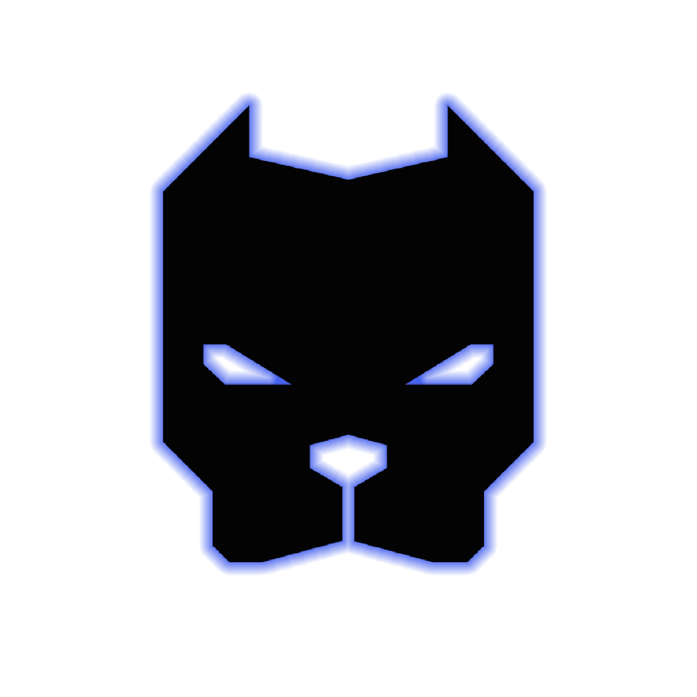

# Nitro.ai (formerly Louie.ai)

[](https://app.netlify.com/sites/nitroai/deploys)

> A knowledge base chatbot, pre-trained on WSBB's Shopify data

Pulling blog and product data from the Shopify Admin API.

Powered by [OpenAI Node SDK](https://github.com/openai/openai-node), [Langfuse](https://langfuse.com), and [Supabase](https://supabase.com)

## 🏁 Quickstart

```bash
## one-liner
nvm use && yarn && yarn dev
```

## Useful links

- https://github.com/openai/openai-node
- https://platform.openai.com/docs/guides/function-calling
- https://platform.openai.com/docs/guides/distillation
- https://langfuse.com/docs/prompts/get-started#use-prompt
- https://supabase.com/docs/reference/javascript/
- https://shopify.dev/docs/api/admin-graphql/

## &#129497;&#8205;&#9794;&#65039; Dev server

```bash
yarn dev
```

## 🟢 Production server

```bash
yarn start
```

## 🤖 Server Relay Methods

All "server" methods are lambda functions, located in the `functions` folder; they are currently hosted by Netlify. However, the server logic is located in `server`. It is relatively amorphous code, and can be adapted to AWS, GCP, Vercel, etc. easily.

NOTE: ensure you have `netlifi-cli` installed, and are signed in.

```bash
yarn netlify
```
